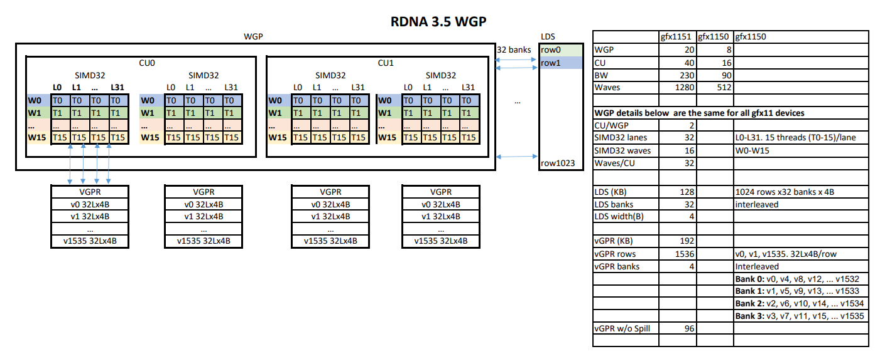

# rocprof-unified-viewer

Fuse the profiling layers rocprofv3 gives you -- CPU (HIP-API) overhead, GPU
kernel timing, per-kernel hardware stall counters, and achieved DRAM bandwidth --
into ONE self-contained HTML timeline. No server, no dependencies, no network:
open the file in any browser.

v1 is specialized for **llama.cpp / ggml decode on gfx1151** (Strix Halo), but it
consumes generic rocprofv3 CSVs and has room to grow.

## Why this exists

No single existing tool overlays all of these layers at once:

- **Perfetto** shows the CPU and GPU tracks, but it can't tie a PMC counter back
  to the slice that produced it, chokes on large traces, and has no aggregate
  summary panel beside the timeline.
- **rocprof-compute** gives per-kernel counters but no timeline and (on the
  gfx1151 boards) resolves to a debug build that crashes on counter collection.

This tool renders a Canvas timeline with a **CPU (HIP-API) lane above** and a
**GPU (kernel) lane below** on a shared time axis, colors each GPU slice by its
**dominant stall reason**, and shows a **per-kernel-family summary** with achieved
bandwidth, stall breakdown, and load width -- all in one page, with hover detail
and a token stepper.

### Small window, not 128 tokens

Decode is **periodic**: every generated token replays the same kernel sequence.
128 tokens is ~99% redundant repetition -- exactly what makes Perfetto unusable.
The viewer defaults to a tiny **2-token** window (`--tokens 2`), landing in steady
state past warmup (`--skip-tokens 30`), so you see one clean period instead of a
wall of duplicates.

## Install

```bash
pip install -e .
```

This exposes two console scripts:

- `rocprof-unified-viewer` -- the HTML generator
- `rocprof-disasm-loadwidth` -- the load-width disassembly helper

Both are stdlib-only, so you can also just run them in place with no install:

```bash
python3 rocprof_unified_viewer.py --help
python3 disasm_loadwidth.py <build-dir>
```

## Producing the inputs

### One command (recommended)

Run [`collect.sh`](collect.sh) **on the board** (rocprofv3 needs the GPU). It runs
llama-bench under rocprofv3 three times (sys-trace, PMC stall counters, PMC
FETCH_SIZE) and then disassembles the device code for load widths:

```bash
./collect.sh \
    --build-dir /path/to/llamacpp-build \
    --model     /path/to/Model-Q4_K_M.gguf \
    --out-dir   ./run \
    -- -fa 1 -r 1
```

Outputs land under `./run/{trace,stall,fetch}/<host>/*.csv` and
`./run/loadwidth.json`. `collect.sh` prints the exact `rocprof-unified-viewer`
command to run next.

By default `collect.sh` collects a **decode** workload (`-p 0 -n <-n>`). To
profile **prefill** (prompt processing) instead, pass `--prompt N` -- every run
switches to `-p N -n 0` (one forward pass; `-n`/`--pmc-n` no longer apply) and
`clean_tps.txt` then holds prompt-processing tp (pp), not decode tg. Feed the
trace to the viewer with `--mode prefill` (the printed command already does):

```bash
./collect.sh \
    --build-dir /path/to/llamacpp-build \
    --model     /path/to/Model-Q4_K_M.gguf \
    --out-dir   ./run-prefill \
    --prompt    128 \
    -- -fa 1 -r 1
```

For the optional per-instruction stall layer, [`collect-att.sh`](collect-att.sh)
captures + decodes a single kernel's thread trace (`--att-dir` input); see
[ATT thread-trace stalls](#att-thread-trace-stalls---att-dir).

### By hand

The four rocprofv3 invocations `collect.sh` wraps are, roughly:

```bash
# 1. sys-trace: real timing, CPU + GPU lanes (shared clock)
rocprofv3 --sys-trace --output-format csv -d run/trace -- \
    ./llama-bench -m M.gguf -p 0 -n 8 -fa 1 -r 1

# 2. PMC counters: stall classification + raw cycles for the EA/ALU busy ratios
rocprofv3 --pmc MemUnitBusy L2CacheHit WriteUnitStalled OccupancyPercent \
    Wavefronts LDSBankConflict GRBM_EA_BUSY GRBM_GUI_ACTIVE \
    SQ_INST_CYCLES_VALU SQ_BUSY_CYCLES --output-format csv -d run/stall -- \
    ./llama-bench -m M.gguf -p 0 -n 2 -fa 1 -r 1

# 3. PMC FETCH_SIZE: measured DRAM read bytes -> achieved bandwidth
rocprofv3 --pmc FETCH_SIZE --output-format csv -d run/fetch -- \
    ./llama-bench -m M.gguf -p 0 -n 2 -fa 1 -r 1

# 4. per-family load widths from device disassembly
rocprof-disasm-loadwidth /path/to/llamacpp-build > run/loadwidth.json
```

The kernel + hip CSVs come from the SAME sys-trace run so they share a clock and
overlay correctly. PMC serializes and replays kernels once per counter-set pass,
which distorts timing -- so the PMC/FETCH CSVs come from SEPARATE runs and are
joined to slices by kernel-name **family** (per-family aggregate, never
per-dispatch).

## Generating the overlay

```bash
rocprof-unified-viewer \
    --kernel-csv     run/trace/<host>/*_kernel_trace.csv \
    --hip-csv        run/trace/<host>/*_hip_api_trace.csv \
    --pmc-csv        run/stall/<host>/*_counter_collection.csv \
    --fetch-csv      run/fetch/<host>/*_counter_collection.csv \
    --loadwidth-json run/loadwidth.json \
    --gguf           model.gguf \
    --out overlay.html --tokens 2
```

Only `--kernel-csv` and `--out` are required; every other input is optional and
adds a layer (`--hip-csv` = CPU lane, `--pmc-csv` = stall coloring, `--fetch-csv`
= achieved-bandwidth column, `--loadwidth-json` = per-lane load width in the
detail panel, `--gguf` = per-dispatch weight-tensor identity + padding/over-fetch,
`--att-dir` = per-instruction thread-trace stalls in the detail panel).
Then just open `overlay.html` -- it is fully self-contained.

### GGUF weight mapping (`--gguf`)

Decode is strictly periodic: every token replays the same kernel sequence in the
same order. So each `mul_mat_vec` dispatch can be order-mapped to the exact GGUF
weight tensor it multiplies, giving each matvec slice a true identity in the detail
panel: weight name, `[K x N]` shape, quant type, packed on-disk footprint, launch-N
vs true-N padding, and a **measured over-fetch ratio** (per-family+N `FETCH_SIZE` /
packed bytes).

The join key is the launched output-row count `N = Grid_Size_X / Workgroup_Size_X`,
which equals the weight's true `ne[1]`. The kernel-name `(ggml_type)` template arg is
*not* a reliable weight-quant proxy (Q5_K weights dispatch under Q4_K/Q6_K kernels),
so the map joins on **shape (N), not type**. `ffn_gate`+`ffn_up` are fused into one
SwiGLU dispatch at decode; the tool tries both dropping and keeping `ffn_up` and picks
whichever candidate best matches the trace. On Qwen3.5-4B-Q4_K_M (gfx1151) the map is
100% (217 matvec dispatches/token), padding is ~0 (aligned shapes), and over-fetch is
~1.0x -- confirming the decode matvecs are clean read-once streams with no tiling waste.
The mapping % is shown in the header; the parser is stdlib-only (mmap, no `gguf` pip
dep) and only walks the tensor-info table (never reads the 2+GB of weights).

### ATT thread-trace stalls (`--att-dir`)

The PMC layer tells you a kernel family is (say) memory-bound in aggregate; ATT
(Advanced Thread Trace) tells you **which instruction the waves are stalled on,
cycle by cycle**. Point `--att-dir` at a directory of *decoded* rocprofv3 `--att`
output (the `stats_ui_output_*_dispatch_*.csv` files) and the selected-kernel
detail panel gains an **ATT thread-trace stalls** section: total stall / latency /
idle cycles, the top stalling instructions (with % of stall), and stall grouped by
opcode. A matvec dominated by `s_waitcnt vmcnt` is waiting on global-memory loads
= bandwidth-bound; a large `ds_`/`lgkmcnt` share points at LDS; a VALU-heavy tail
that isn't hidden under memory latency is a dequant-cost lever.

ATT is a **microscope**: rocprofv3 instruments ~1 CU/SIMD for a few dispatches, so
it only enriches the kernel families it actually traced (treat the numbers as a
representative profile, not a full-GPU count). Because you trace one kernel at a
time, the workflow is: **click a kernel in the overlay** -> its detail panel prints
the exact `collect-att.sh --kernel '<symbol>'` command (with a copy button) ->
run that on the board -> re-run the viewer with `--att-dir <out>` to fold the
decoded trace back into the same view. (The static HTML can't SSH itself, so it
hands you the command rather than running it -- see [`collect-att.sh`](collect-att.sh).)
The printed command uses **full paths and no env vars**, so it runs as-is: pass
`--build-dir` (and `--gguf` for the model) when generating the overlay and they are
baked into the command; the regen line reproduces the exact flags you used.

```bash
# on the gfx1151 board: trace one kernel (the overlay prints this line for you)
./collect-att.sh --kernel 'mul_mat_vec_q_wvsplitk' \
    --build-dir /path/to/build --model model.gguf --out-dir att-wvsplitk
# then regenerate the overlay with the decoded stalls folded in
rocprof-unified-viewer <existing flags> --att-dir att-wvsplitk --out overlay.html
```

ATT filters by kernel **symbol**, so a trace of `mul_mat_vec_q` captures every
quant/shape variant of it; the viewer keys the folded stalls by the same family
name (quant suffix included) as the rest of the overlay, so they line up.

By default `collect-att.sh` runs a short `llama-bench` decode as the workload.
For single-kernel optimization you can point ATT at a **single-op evaluator**
instead, with `--runner "CMD"` -- the command runs with its working directory set
to `--build-dir`, so a bundled binary is `./name`. This isolates one op (no full
model graph), which means far fewer cut-off dispatches and controlled shapes. For
example, using the llama.cpp `test-backend-ops` perf harness:

```bash
./collect-att.sh --kernel 'mul_mat_vec_q' \
    --build-dir /path/to/build/bin --out-dir att-mmvq --rocm /path/to/rocm \
    --runner './test-backend-ops perf -o MUL_MAT -p type_a=q4_K'
```

With `--runner`, `--model` is not required and `-n` / trailing `-- llama-bench
flags` do not apply (put any workload flags inside the quoted runner string). The
companion server exposes the same option as `serve.py --runner "CMD"`.

#### Open debug view (annotated ISA)

The summary above is a top-N digest. For single-kernel optimization the detail
panel also offers an **Open debug view** button (shown once ATT data is loaded for
that kernel). It opens a **new browser tab** with the kernel's *complete*
program-order disassembly -- every instruction with its address, hit count,
latency, stall, stall%, and idle cycles -- with a stall heat bar and a text filter,
so you can scan a few thousand instructions for the hot PCs on a full screen. The
tab is written client-side from data already embedded in the page, so it works both
from a static HTML file and from the companion server (after **Trace now**).

Hovering any instruction shows a tooltip with a one-line description of that opcode,
drawn from a built-in RDNA3.5 ISA glossary (keyed on the mnemonic, matched after
stripping `_e32`/`_e64`/`_dpp` encoding suffixes). So you can read a raw disassembly
without cross-referencing the AMD "RDNA3.5" Instruction Set Architecture reference.
The glossary is embedded only when a debug view exists, so the no-ATT path is
unchanged.

Special registers and wait-counters in the operand text are also hoverable: tokens
like `vmcnt`, `vscnt`, `lgkmcnt`, `expcnt`, `scc`, `exec`, `vcc`, `m0` are underlined
and show what they mean on hover (e.g. `s_waitcnt vmcnt(0)` explains that `vmcnt` is
the outstanding vector-memory-load counter). This resolves the two things you need to
read a wait-heavy decode kernel -- what the opcode does and which hardware counter it
is blocking on -- without leaving the page.

Linking ISA back to **source lines** requires the traced code object to carry DWARF
line tables. A default release build of `libggml-hip.so` has none, so the debug
view is **ISA-only** and shows a note to that effect. To enable source linking,
build ggml-hip with line info (`-gline-tables-only`, or `-g`) and re-trace; the
decoder then populates per-instruction line info and the view becomes a
**synchronized two-pane** layout: the program-order ISA on the left (the driving
pane), source on the right (per-line stall heat). Clicking an instruction jumps to
its source line; clicking a source line highlights and scrolls to its instructions.
Source text is embedded by basename only -- the absolute build path never reaches
the HTML.

#### Step mode (executed order)

When the trace also decoded per-wave execution streams, the debug view adds a
**Step** control that walks one representative wave's instructions in *executed*
order (following real branches and loops), rather than static program order. Use
**Prev/Next** (or the arrow keys) to advance one executed instruction at a time, and
the **src line** buttons (or **H**/**L**) to jump to the next/previous distinct
source line. Both panes highlight and scroll to the current step, and a readout
shows the step index, the elapsed cycle offset, and the per-step **dwell** (cycles
until the next issue) -- so a long dwell on an `s_waitcnt` reveals exactly where the
wave stalls on memory. This reflects the one sampled wave, not an average over all
waves.

#### Wave View (occupancy global view)

When per-wave state timelines were decoded, the debug view header shows a **Wave
View** button that opens a full-screen occupancy view laid out like
rocprof-compute-viewer's Global View: a structured left gutter of **SE / SA / CU /
SM / SL / ID** columns identifies each wave, every captured wave is one horizontal
lane, all lanes share a single (absolute) cycle axis, and each lane is colored by the
wave's hardware state over time -- **Exec** (green), **Wait** (amber, e.g. blocked on
`s_waitcnt`), **Stall** (red), and **Idle** (grey). Lanes are sorted by hardware
location (SE, CU, SIMD, slot, wave id) with a separator between SIMD groups. Because
the lanes are cycle-aligned you can see the whole dispatch's wave occupancy at a
glance: how many waves are resident concurrently, how their lifetimes stagger as slots
free up, and how much of each wave's life is spent waiting on memory versus executing
-- for a bandwidth-bound decode kernel the lanes are overwhelmingly amber. Hover any
lane for its full coordinates, state, cycle, begin/end/duration, and kernel. A
group-by selector also offers an aggregate-by-slot mode (all waves that shared a slot
overlaid on one lane). SA is not carried in the ATT wave records (single-SA capture),
so it renders 0. Each wave's timeline is downsampled and run-length encoded at
generation time, so the view stays a few tens of KB regardless of dispatch length.
Press **Esc** or **Close** to return.

### Live tracing (companion server)

The copy-paste ATT round-trip above works but is clunky. `serve.py` closes the
loop: run it **on your workstation**, open the served page, click a kernel, hit
**Trace now**, and the ATT trace runs on a GPU board and folds into the detail
panel live -- no copy-paste, no regenerate.

```bash
# a colon-separated list of GPU boards to dispatch ATT to (NOT in the repo --
# put this in your shell profile; no hostname is ever hardcoded in the code)
export ROCPROF_ATT_HOSTS="board-a:board-b:board-c"
export ROCM_DIR=/path/to/rocm          # board-side ROCm (drives rocprofv3 + rocm-smi)
export ROCPROF_ATT_OUT_BASE=/nfs/scratch/att   # dir shared between workstation + boards

rocprof-unified-viewer-serve \
    --kernel-csv     run/trace/<host>/*_kernel_trace.csv \
    --hip-csv        run/trace/<host>/*_hip_api_trace.csv \
    --pmc-csv        run/stall/<host>/*_counter_collection.csv \
    --fetch-csv      run/fetch/<host>/*_counter_collection.csv \
    --loadwidth-json run/loadwidth.json \
    --gguf           model.gguf \
    --build-dir      /path/to/llamacpp-build
# then open http://localhost:8756
```

How it works and why it is safe:

- **The server runs locally; only GPU work goes to a board.** The web server
  binds `127.0.0.1` only. When you click **Trace now**, it picks a board from
  `$ROCPROF_ATT_HOSTS` whose GPU is idle (`ssh <host> rocm-smi --showuse`,
  free = use `<= --busy-threshold`, default 10%), pipes the repo's current
  `collect-att.sh` over `ssh <host> bash -s` to run ATT there, then reads the
  decoded CSVs straight off shared NFS (`$ROCPROF_ATT_OUT_BASE`) -- no scp.
- **No hardcoded hostnames.** The board list lives entirely in the environment
  variable; nothing host-specific is committed.
- **Only real kernels are traceable.** The requested symbol must exactly match a
  kernel family already in the loaded trace (allowlist); the ssh argv is built as
  a list with the symbol `shlex`-quoted (never `shell=True`).
- **One trace at a time.** The board GPU + ATT is exclusive, so a second request
  while one is running gets `409 busy`; the page stays responsive meanwhile.
- **The static export path is unchanged.** Opened as a plain file, the overlay
  behaves exactly as before -- **Trace now** only appears when served.

For GPU-free testing, `--stub-att-dir DIR` returns `load_att_stats(DIR)` for
every trace request instead of ssh-ing to a board, exercising the whole
click -> trace -> fold loop against an existing decoded `--att-dir`.

| Flag (serve.py, in addition to the viewer flags) | Default | Meaning |
| --- | --- | --- |
| `--port` | `8756` | localhost port to serve on |
| `--hosts-env` | `ROCPROF_ATT_HOSTS` | env var holding the colon-separated board list |
| `--model` | (`--gguf`) | GGUF model to run under ATT on the board |
| `--rocm` | `$ROCM_DIR` | board-side ROCm dir (rocprofv3 + rocm-smi) |
| `--out-base` | `$ROCPROF_ATT_OUT_BASE` | NFS scratch base for `att-<sym>/` trace dirs |
| `--busy-threshold` | `10` | GPU use% at/under which a host counts as free |
| `--bench-flags` | `-fa 1` | llama-bench flags passed to collect-att.sh |
| `--trace-timeout` | `300` | seconds to wait for a board ATT trace |
| `--stub-att-dir` | - | GPU-free testing: return `load_att_stats(DIR)` per request |

### CLI reference (viewer)

| Flag | Default | Meaning |
| --- | --- | --- |
| `--kernel-csv` | (required) | rocprofv3 `*_kernel_trace.csv` (GPU slices) |
| `--hip-csv` | - | `*_hip_api_trace.csv` (CPU/host HIP-API lane) |
| `--pmc-csv` | - | `*_counter_collection.csv` stall counters (coloring) |
| `--fetch-csv` | - | `*_counter_collection.csv` FETCH_SIZE (achieved BW) |
| `--loadwidth-json` | - | per-family load widths from `disasm_loadwidth.py` |
| `--att-dir` | - | decoded rocprofv3 `--att` dir: per-instruction stalls in detail panel |
| `--gguf` | - | GGUF model: order-map matvec dispatch -> weight (shape/pad/over-fetch) |
| `--build-dir` | - | llama.cpp build dir: baked into the detail-panel ATT command as a full path (no env vars to fill in) |
| `--clean-tps-file` | - | `collect.sh`'s `clean_tps.txt` (untraced llama-bench run): shows the honest decode tok/s in the header, since rocprofv3 perturbs the traced runs |
| `--arch` | `gfx1151` | selects peak DRAM BW for the roofline |
| `--peak-bw` | (from arch) | override peak DRAM bandwidth in GB/s |
| `--out` | (required) | output HTML path |
| `--tokens` | `2` | decode tokens shown in the viewport |
| `--skip-tokens` | `30` | tokens to skip before the window (past warmup) |
| `--context-tokens` | `0` | extra tokens baked on each side for the stepper |
| `--gap-threshold-us` | `150` | inter-dispatch gap marking a token boundary |
| `--title` | `llama.cpp decode overlay (gfx1151)` | HTML title |

## RDNA 3.5 hardware reference

The selected-kernel **fusion-analysis** panel models occupancy from the RDNA 3.5
(gfx1151) WGP layout: 20 WGP, each = 2 CU = 4 SIMD32, each SIMD32 holds 16 wave32
slots over a 1536-VGPR file, so 1536/16 = **96 VGPR/wave** is the most a wave can
use and still hit full 16-wave occupancy (above that costs resident waves; above
256 spills to scratch). The diagram below is the reference for those constants and
the per-device numbers (gfx1151 vs gfx1150).



The same diagram is available from the generated overlay: the **RDNA 3.5 HW**
toolbar button opens it in a modal. It is embedded as a base64 data URI, so the
overlay stays a single self-contained file (no path to `docs/` to resolve once the
HTML is moved or web-shared).

## gfx1151 / ROCm gotchas

These are baked into `collect.sh`, but if you run rocprofv3 by hand:

- **Use a pinned local ROCm**, not a shared `/opt/rocm` that can be repointed and
  refreshed under you mid-run (silently breaking `--pmc` / comgr / counters).
  Point `collect.sh` at yours with `--rocm DIR` (or `$ROCM_DIR`).
- **`--pmc` counter config needs the SYSTEM ROCm runtime first** on
  `LD_LIBRARY_PATH` (including the `lib/llvm/lib` subdir for libamd_comgr's
  libLLVM), NOT the build dir. The llama.cpp release bundles its own runtime;
  letting it shadow the system one crashes counter config (SIGSEGV / error 38,
  no CSV). `--sys-trace` is the opposite: it needs the build dir on the path so
  llama-bench finds its bundled ggml/hip libs -- which is why the two run types
  set `LD_LIBRARY_PATH` differently.
- **FETCH_SIZE byte counters need a recent llama.cpp build** (b20260715+); older
  builds SIGSEGV during FETCH_SIZE collection.
- **rocprofv3 may exit nonzero** in its rocpd/OMPT postprocess AFTER the CSV is
  flushed -- judge success by the presence of the CSV, not the exit code
  (`collect.sh` does this for you).
- Timing is only trustworthy from the clean `--sys-trace` run; PMC/FETCH runs
  serialize kernels and are used only for per-family counter values.

## License

MIT. See [LICENSE](LICENSE).
